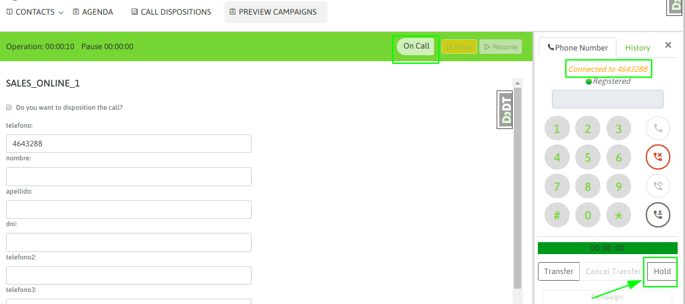

Poner en espera una llamada
***************************

En medio de cualquier tipo de llamada en curso, el agente puede poner en espera al teléfono en el otro extremo
de la comunicación. Esto se logra hundiendo el botón "hold" del webphone de agente.

.. image:: images/about_agent_callactions_hold_2.png

Transferencia directa a agente
******************************

Transferencia directa a número externo
**************************************

Transferencia con consulta a agente
************************************

.. image:: images/about_agent_callactions_ag2ag_ct.png

Transferencia con consulta a número externo
********************************************

Transferencia a otra campaña
*****************************

Observar grabación de llamada
*****************************

.. image:: images/about_agent_callactions_tag_call.png

Agendamiento de llamadas
************************

gendamiento general (solo para campañas salientes con discador):

Permite añadir nuevamente un contacto procesado por un agente a la cola de números a marcar por el discador.
Cuando el discador arroja una llamada al agente y éste resuelve que el contacto deberá ser vuelto a llamar por el discador, sin la necesidad de que éste sea necesariamente atendido por el mismo agente, entonces se utiliza el agendamiento general.

Para realizar una agenda general, se debe realizar a través de la PDA. Ésto es, cuando el agente califica el contacto, debe hacer seleccionar la opción “Agendado”.

Una vez seleccionada esa opción, se despliega el formulario donde se especifican el día y horario agendado. Se pueden agregar también observaciones:

En este ejemplo, se agenda el contacto para el día y la hora consignada por el agente que atendió, quien también puede dejar observaciones acerca de la llamada. De esta forma, el discador volverá a realizar el contacto enviando la llamada a cualquier agente, quien podrá ver la calificación y las observaciones que quedaron guardadas.
3.5.2 Agendamiento personal:

Permite añadir nuevamente un contacto procesado por un agente a la agenda personal del agente en cuestión. La lista de contactos agendados para llamar en el futuro está disponible en Agenda.
La manera de agendar es similar. Solo que hay que seleccionar “Personal” en lugar de “Global”:

Finalmente, la entrada en la agenda personal del agente quedará disponible ingresando a Agendas:
