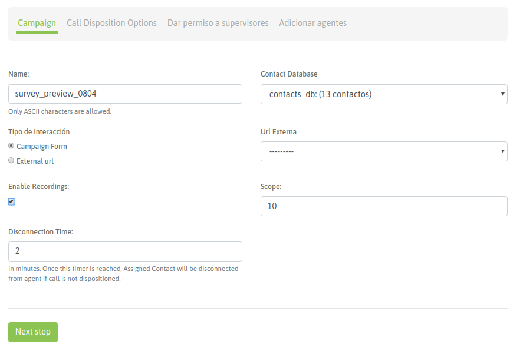

******************
Campañas entrantes
******************

Para crear una nueva campaña, se debe ir a Campaña → Campañas Entrantes → Nueva campaña.

Se debe completar la primera pantalla del wizard, como lo expone la figura 1.

*Figure 1: Campaigns parameters*

- Nombre: nombre de la campaña.
- Base de contactos: se utiliza para desplegar datos a partir del número de teléfono que realiza la llamada entrante al sistema.
- Formulario: El formulario que se desplegará cada vez que una llamada entrante es asignada a un agente.
- Objetivo: se trata de la cantidad de gestiones que se desean lograr para la campaña. Este valor es tenido en cuenta a la hora de mostrar el avance de la campaña (porcentaje de gestiones existentes sobre el objetivo) en el módulo de supervisión.

Para continuar se debe hacer click en “Paso Siguiente” y avanzar con los campos de la segunda pantalla.

*Figure 1: Campaigns parameters*

- Tiempo de ring: es el tiempo (en segundos) que el teléfono de la consola de agente sonará alertando una nueva llamada. Este parámetro tiene sentido siempre y cuando el grupo de agentes que reciben llamadas no tengan configurada la opción de “Auto-Atención de Llamadas”, ya que en ese caso la llamada conectará directamente con el agente.
- Tiempo de reintento: es el tiempo (en segundos) que la llamada quedará en la cola de espera, hasta volver a intentar conectarla con otro agente disponible.
- Audio de ingreso: permite definir si se reproducirá algún audio al ingresar a la cola de llamadas. Para que esté disponible en el selector desplegable debe cargarse previamente el archivo desde el menú “Audios”.
- Cantidad máxima de llamadas: es el número de llamadas que se permiten poner en cola de espera. Por encima de ese número, la llamada será enviada a la acción “failover”.
- Nivel de servicio: es un parámetro para medir cuántas de las llamadas fueron contestadas dentro de esa franja de tiempo. El valor se expresa en segundos.
- Estrategia de distribución: método de distribución de llamadas que usará la campaña sobre los agentes. Para campañas salientes, se recomienda RRmemory.
- Importancia de la campaña: Es un parámetro lineal en la escala del 1 al 10, que implica cuán importante son las llamadas de esta campaña respecto a otras. Establece prioridades para los agentes que trabajan en varias campañas en simultáneo. Si se deja el valor en “0” (por defecto) se mantiene una equidad con el resto de las campañas.
- Tiempo de espera en cola: es el tiempo (en segundos), que la llamada contactada quedará en cola de espera, aguardando que un agente se libere para conectarle la misma.
- Grabar llamados: se debe tildar este check en caso de requerir que los llamados sean grabados.
- Anuncio periódico
- Frecuencia del anuncio
