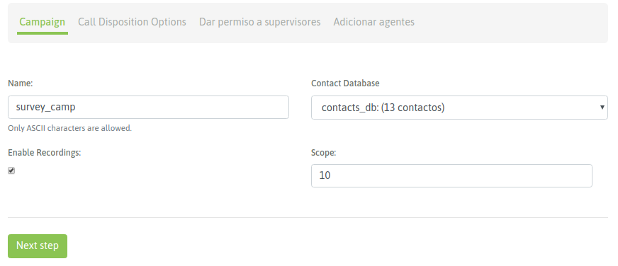
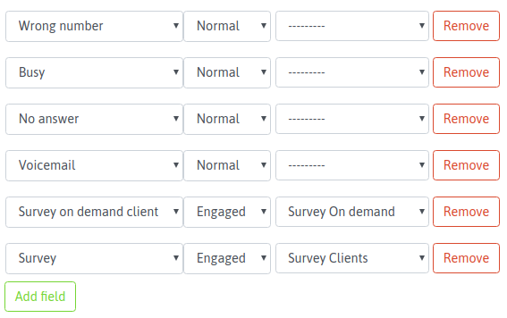
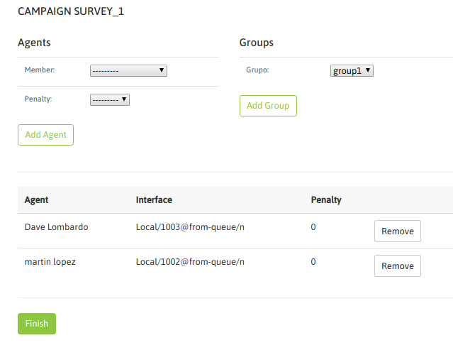
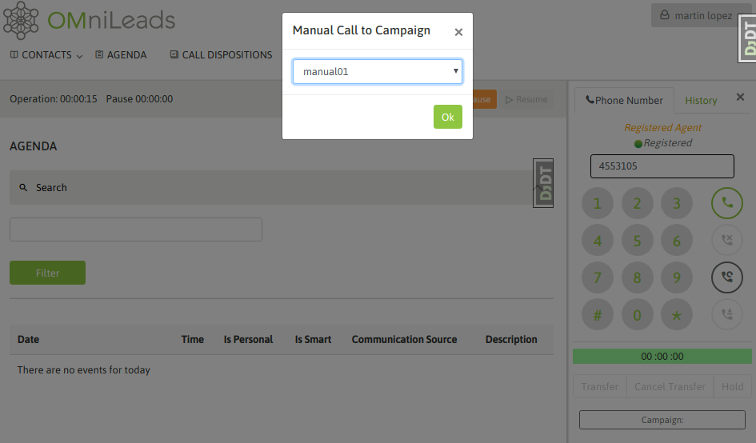
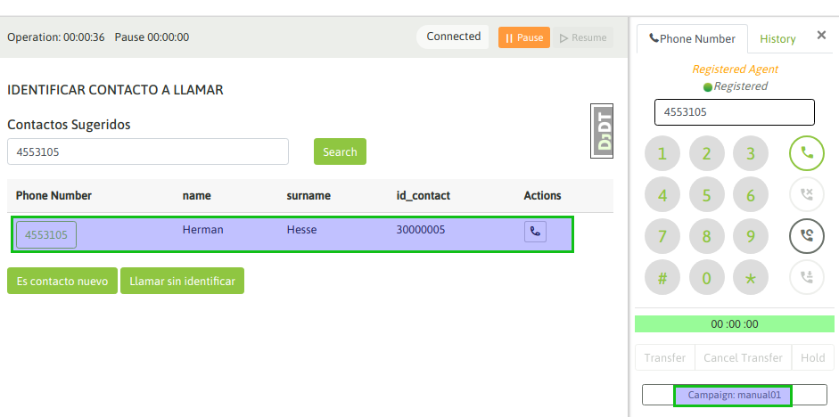
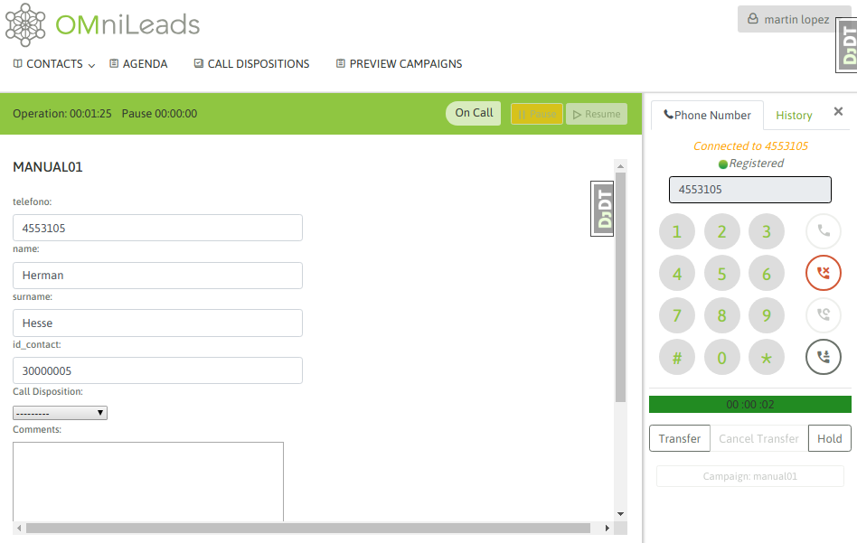
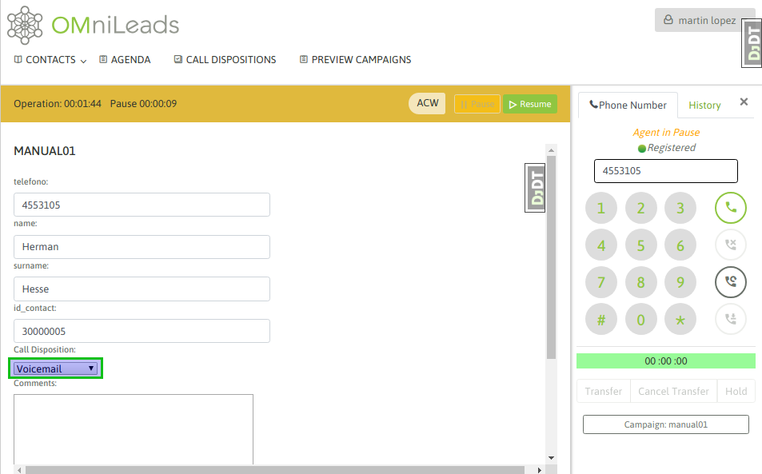
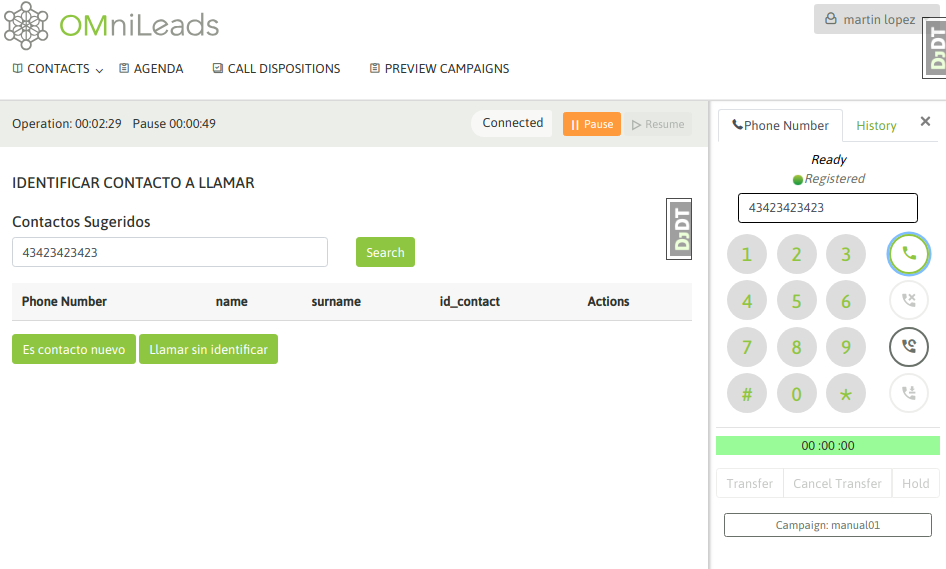
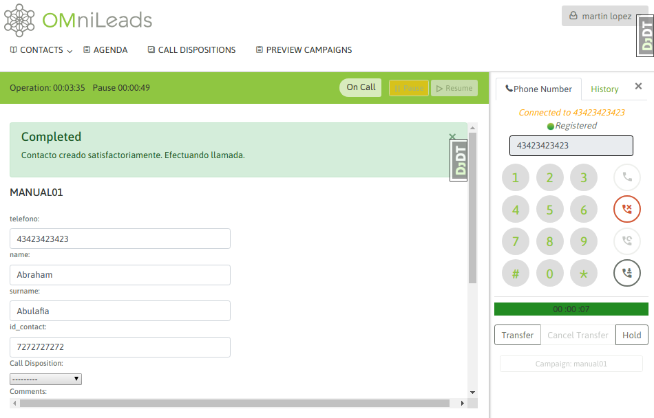

********************
Manual Call Campaign
********************

Para crear una nueva campaña manual se debe ingresar al punto de menú *Manual Campaigns -> New  Campaign*. El proceso de creación consta de
un wizard de dos pantallas.

La primera pantalla nos invita a indicar una serie de parámtros de la campaña, como lo indica la figura 1.

*Figure 1: Campaigns parameters*

- **Name:** nombre de la campaña
- **Contact database:** se utiliza para desplegar datos a partir del número de teléfono origen que realiza la llamada entrante al sistema.
- **External URL:** URL a disparar cada vez que el agente lo indique.
- **Enable recordings:** habilitar que todas las llamadas de la campaña sean grabadas.
- **Scope:** se define como la cantidad de gestiones positivas que se esperan para la campaña. En la supervisión de la campaña se muestra en tiempo real el porcentaje de avence de la campaña respecto al objetivo definido.

**Nota 1:** El tema de la base de contactos en las campañas manuales (y también entrantes) plantea un escenario flexible, ya que es Opcional el asignar una base de contactos a este tipo de campañas.
En este caso, la base de contactos es utilizada si deseamos que cada vez que un agente marca un teléfono que corresponde con un contacto de la base, se pueda recuperar los datos (columnas extras al teléfono de la base) del mismo
y además poder calificar el contacto en la campaña..

En la segunda pantalla se deben asignar las calificaciones que se requieran para que los agentes puedan clasificar cada llamada realizada al contacto. Como se puede apreciar
en la figura 2, en nuestro ejemplo manejamos dos calificaciones que disparan dos formularios diferentes.

*Figure 2: Call dispositions*

En los siguientes pasos se pueden añadir supervisores y agentes a nuestra campaña.

*Figure 3: agent assignment*

Finalmente cuando un agente asignado a la campaña realice un login a la plataforma y comience a marcar llamadas desde
su webphone, el sistema le permite seleccionar a qué campaña asignar cada llamada manual generada desde el webphone, tal como se expone
en la figura 5.

*Figure 4: Manual call camp selection*

Cuando un agente se encuentra online y marca un teléfono correspondiente a un contacto de la base de la campaña, el contacto cuyo teléfono coincide con el teléfono marcado por el agente
es desplegado como contacto a seleccionar y así desplegar sus datos en la pantalla de agente, también se permite generar un nuevo contacto. Entonces el agente puede o bien confirmar que la llamada se dispara hacia
el contacto listado o sino también crear un nuevo contacto y marcarlo.
Los datos (extras al teléfono) del contacto son desplegados en la pantalla de agente

*Figure 5: agent assignment*

Si se selecciona llamar al contacto listado, entonces los datos del mismo son desplegados en pantalla, como lo expone la figura 6.

*Figure 6: agent assignment*

De esta manera el agente puede asignar una calificación sobre el contacto llamado; figura 7.

*Figure 7: call disposition assignment*

Por otro lado, si el teléfono marcado no corresponde a ningún contacto de la base entonces el sitema permite al agente buscar el contacto en la base o generar un nuevo contacto. En caso de tratarse
de una campaña sin base de contactos, entonces cada llamado que realice un agente implica que se genere el contacto asociado a la llamada marcada (figura 5 y 6).

*Figure 8: new contact add to campaign database screen 1*

.. image:: images/campaigns_manual_agconsole6.png

*Figure 9: new contact add to campaign database screen 2*

Entonces al momento de marcar a un número que no devuelva un contacto. el agente pasará por una vista en la que primero el agente debe añadir el contacto como un registro de la base de la campaña para luego marcar.
Finalmente se despliegan el nuevo contacto y la opción de clasificar la llamada con alguna calificación (figura 10).

*Figure 10: new contact called*
