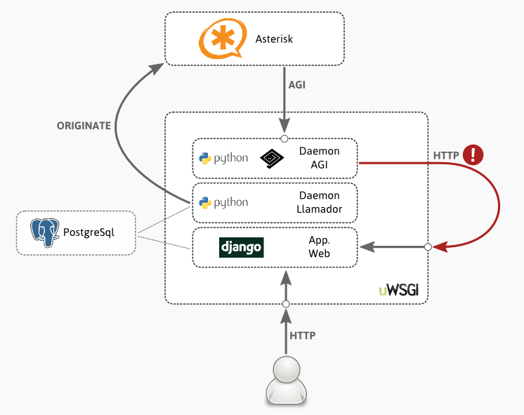

.. FTSender documentation master file, created by
   sphinx-quickstart on Wed Apr 30 10:52:05 2014.
   You can adapt this file completely to your liking, but it should at least
   contain the root `toctree` directive.

Documentacion de FTSender
=========================

Arquitectura
------------

Acceso al sistema
-----------------

El sistema puede ser accedido utilizando la URL http://ip-del-servidor:8088

Usuarios
--------

El sistema funciona bajo el usuario ``ftsender``. La aplicacion se encuentra en el directorio ``/home/ftsender/deploy``:

.. code::

    [ftsender@prueba-deploy-fts deploy]$ ls -lh ~/deploy/
    total 32K
    drwxr-xr-x. 6 ftsender root     4.0K May 21 22:17 app
    drwxr-xr-x. 2 ftsender root     4.0K May 21 22:17 bin
    drwxr-xr-x. 2 ftsender root     4.0K May 18 20:20 local
    drwxr-xr-x. 2 ftsender root     4.0K May 18 18:49 log
    drwxr-xr-x. 5 ftsender root     4.0K May 18 19:15 media_root
    drwxr-xr-x. 2 ftsender root     4.0K May 21 22:44 run
    drwxr-xr-x. 5 ftsender root     4.0K May 18 19:04 static_root
    drwxrwxr-x. 6 ftsender ftsender 4.0K May 18 19:36 virtualenv

En el directorio ``/home/ftsender/deploy/log`` se encuentran 2 archivos de log:

.. code::

    [ftsender@prueba-deploy-fts deploy]$ ls -lh ~/deploy/log/
    total 592K
    -rw-rw-r--. 1 ftsender ftsender  17K May 21 22:44 django.log
    -rw-r-----. 1 ftsender ftsender 565K May 21 22:44 uwsgi.log

En ``django.log`` se encuentran los logs de la aplicación.

Servicios
---------

El deploy del sistema incluye el setup de 2 servicios (Asterisk y FTSender):

.. code::

    [ftsender@prueba-deploy-fts deploy]$ ls -lh /etc/init.d/asterisk-11-ftsender /etc/init.d/ftsender-daemon 
    -rwxr-xr-x. 1 root root 1.7K May 21 22:17 /etc/init.d/asterisk-11-ftsender
    -rwxr-xr-x. 1 root root 1.8K May 18 19:20 /etc/init.d/ftsender-daemon

Para bajar el sistema FTSender (toda la aplicación: web y daemon), basta con ejecutar:

.. code::

    $ sudo service ftsender-daemon stop

Asterisk
--------

El sistema por default utiliza la instalación de Asterisk ubicada en ``/opt/asterisk-11``.
El script de deploy **modifica** los archivos allí encontrados para:

 * crear un usuario para el manager
 * activar la interfaz web
 * incluir los 2 archivos de configuración generados por el sistema (dialplan y queues).

Los archivos de configuración **generados por el sistema** son
guardados en el directorio ``/etc/ftsender/asterisk/``:

.. code::

    [ftsender@prueba-deploy-fts deploy]$ ls -lh /etc/ftsender/asterisk/
    total 4.0K
    -rw-r--r--. 1 ftsender ftsender 2.5K May 21 22:17 extensions.conf
    -rw-------. 1 ftsender ftsender    0 May 21 22:17 queues_fts.conf

Para acceder al CLI de Asterisk:

.. code::

    $ sudo -u asterisk /opt/asterisk-11/sbin/asterisk -rvvvv

Lo mismo para ejecutar comandos desde el shell:

.. code::

    $ sudo -u asterisk /opt/asterisk-11/sbin/asterisk -x 'core show calls'

Contents
--------

.. toctree::
   :maxdepth: 2
   :glob:

   fts_web_*
   fts_daemon_*

Indices and tables
==================

* :ref:`genindex`
* :ref:`modindex`
* :ref:`search`

