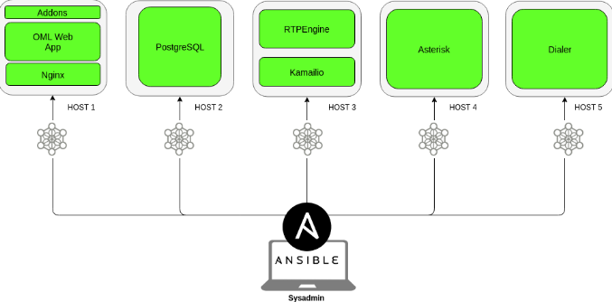

Horizontal Cluster Installation
===============================

OMniLeads puede ser desplegado de manera tal que los componentes queden separados en diferentes hosts. A diferencia de la instalación AIO (All In One)
que despliega todo OMniLeads en un único host, este método de instalación permite dividir la carga de los servicios en más de un host.

Puntualmente existen dos formas de instalar en cluster horizontal:

- OMniLeads II
Host1 para los servicios: Asterisk y Kamailio
Host2 para los servicios: Aplicación web, Postgres y Dialer

.. image:: images/install_cluster_in_2.png
*Figure 1: *

- OMniLeads V:
Se despliega el sistema en cinco hosts

Host1 "omniapp": contiene los servicios uwsgi, php-fpm, nginx, por lo tanto es aca donde estan el repositorio con el código de la aplicación
Host2 (kamailio): con kamailio, rtpengine
Host3 (asterisk): contiene asterisk y todos sus servicios
Host4 (database): contiene la base de datos postgresql
Host5 (dialer): contiene la aplicación wombat dialer con su respectiva base de datos

*Figure 1: *
