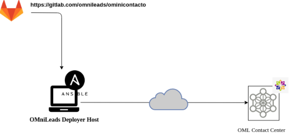
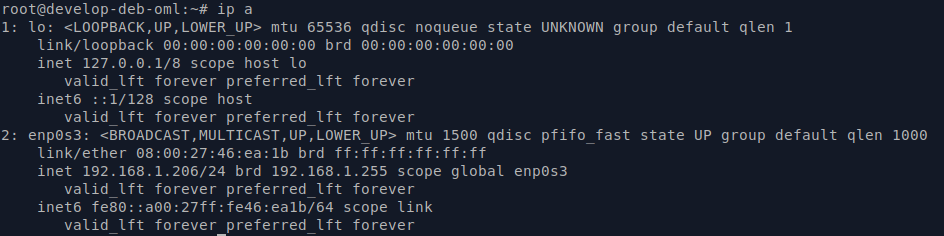
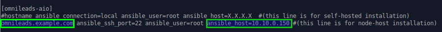
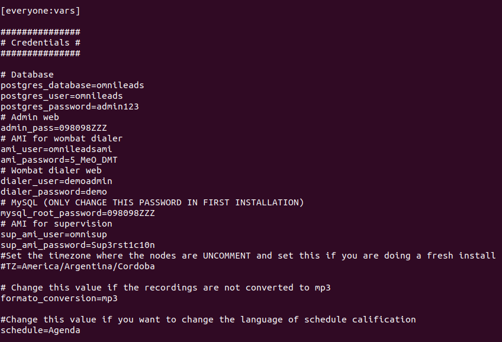
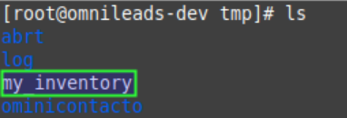
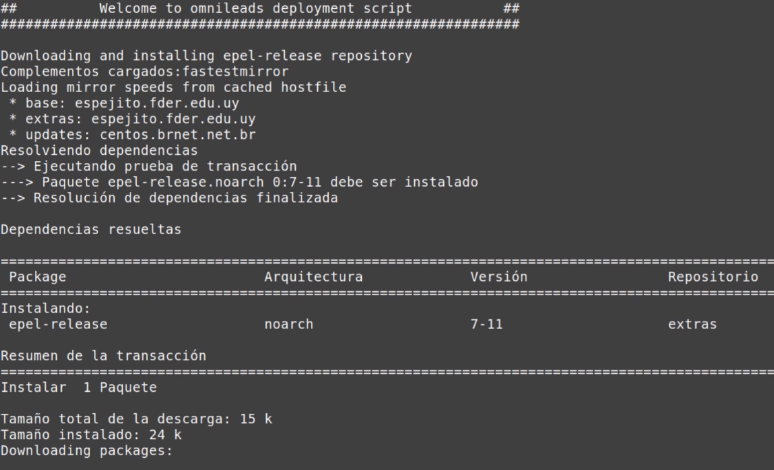
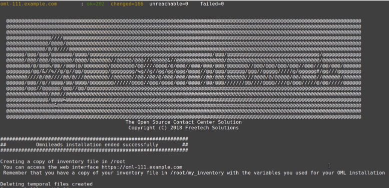

********************************
Instalación desde ansible remoto
********************************

Este tipo de instalación implica que la descarga del proyecto desde el repositorio y la ejecución del script de instalación se realiza desde
la estación de trabajo del sysadmin, ya que precisamente al estar basada en Ansible la instalación se hace viable éste método.

La ventaja principal de esta opción es que el sysadmin puede instalar y mantener varias instancias de OMniLeads desde un único nodo "deployer".

*Figure 1: remote ansible install*

Pre-requisitos:
^^^^^^^^^^^^^^^

- Una instancia de GNU/Linux CentOS 7 (minimal), Debian 9 (netinstall) ó Ubuntu Server 18.04
- 20 GB de espacio en disco
- 4 GB de memoria RAM

- En *Ubuntu / Debian*; Instalar el paquete ssh, permitir login SSH con el usuario root y Reiniciar el servicio de ssh:
::

  apt-get install sudo openssh-server python-minimal -y
  sed -i 's/#PermitRootLogin prohibit-password/PermitRootLogin yes/' /etc/ssh/sshd_config
  systemctl restart ssh

- Es muy importante dejar la hora correctamente configurada en el host.
- Configurar una *dirección IP* y un *hostname* fijo en el host destino de la instalación.

Preparación en la máquina que ejecuta la instalación remota:
^^^^^^^^^^^^^^^^^^^^^^^^^^^^^^^^^^^^^^^^^^^^^^^^^^^^^^^^^^^^

- Debemos contar con el paquete git para luego clonar el repositorio del protyecto y seleccionar el release a instalar.

Ubuntu - Debian:
::
  apt install git
  yum install git
  git clone https://gitlab.com/omnileads/ominicontacto.git
  cd ominicontacto
  git checkout master

CentOS:
::
  yum install git
  git clone https://gitlab.com/omnileads/ominicontacto.git
  cd ominicontacto
  git checkout master

- Se comprueba la *dirección IP* y *hostname* que posee el host destino de la instalación, para luego ajustar el archivo *inventory* que se utiliza a la hora de tomar los parámetros de la instalación.
::

 hostname
 ip a

.. image:: images/install_hostname_command.png
*Figure 2: hostname command output*

*Figure 3: ip a command output*

- En este paso, se debe editar el archivo *inventory* (PATH/ominicontacto/deploy/ansible). El mismo reside dentro del repositorio del proyecto
que se generó en la PC del sysadmin que ejecuta el deploy remoto.

Nota: OMniLeads utiliza ansible para realizar la instalación, por lo tanto existe un "archivo de inventario" que debe ser modificado de acuerdo a los
parámetros del host sobre el que estamos trabajando.

Localizar la sección *[omnileads-aio]* y modificar la cadena 'hostname' por el hostname de nuestro servidor destino de la instalción. También en
esta sección se debe editar el parámetro 'X.X.X.X' con la dirección IP del servidor.

*Figure 4: inventory file network params section*

Además dentro del mismo archivo, unas líneas debajo encontraremos la sección *[everyyone:vars]*, en la cual se pueden alterar variables y contraseñas
que vienen por defecto en el sistema.

*Figure 5: Passwords and parameters of services*

Es importante aclarar que cada vez que se corre el script "./deploy.sh" ya sea para instalar, re-instalar, actualizar, modificar la dirección IP de OML, etc.,
el archivo de inventory se vuelve a "cero". No obstante se genera una copia del archivo (my_inventory), de manera tal que se cuente con los parámetros
del sistema utilizados en la última ejecución del script.
La copia en cuestión se ubica en el path donde ha sido clonado el repositorio de OML y bajo el nombre de "my_inventory" como lo expone la figura 6.

*Figure 6: inevntory copy, my_inventory file*

Ejecución del script de instalación:
^^^^^^^^^^^^^^^^^^^^^^^^^^^^^^^^^^^^

La instalación de OMniLeads se realiza mediante el script *deploy.sh*, ubicado dentro de la carpeta deploy/ansible con respecto a la carpeta
raíz del proyecto (ominicontacto).

Una vez configuradas las variables citadas, se procede con la ejecución del script de instalación (como usuario root).

::

  ./deploy.sh -i -a

*Figure 7: install runing*

A diferencia de la instalación 'Self-Hosted', en este tipo de instalación en remoto, el script nos pide la contraseña del usuario *root* del host
servidor de la instalación.

imagen remota ........ ssh

El tiempo de instalación dependerá mayormente de la velocidad de conexión a internet del host sobre ek que se está corriendo el deplot de  OML,
ya que se deben descargar, instalar y configurar varios paquetes correspondientes a los diferentes componentes de software que conforman el sistema.

IMPORTANTE: en caso de que el proceso de instalación de OML se interrumpa (por fallas de internet, fallas locales del servidor ajenas al software, etc.)
, debe ejecutar nuevamente el script de instalación.

Si la ejecución de la instalación finaliza exitosamente, se despliega una vista como la de la figura 8.

*Figure 8: install runing*

Primer acceso a OMniLeads:
^^^^^^^^^^^^^^^^^^^^^^^^^^

Si la ejecución de la instalación fue exitosa, entonces vamos por el primer acceso a OMniLeads.

.. toctree::
   :maxdepth: 2

   install_first_access.rst

Errores comunes:
^^^^^^^^^^^^^^^^

- El server no tiene internet o no resuelve dominios (configuración de DNS).
*Compruebe el acceso a internet del host (por ej: actualizando paquetes - apt-get update | yum update).*

- Timeout de algún paquete que se intenta bajar. Puede volver a intentar ejecutar el deploy y si vuelve a fallar, la opción puede ser
*Instalar el paquete desde la terminal.*

- Falla por mala sintaxis o falta de definición de *hostname* y *dirección IP* en el archivo *inventory*.
*Revisar archivo inventory*

- No se configuró correctamente el acceso ssh del host destino de la instalación.
*Revisar estado del firewall. Comprobar acceso remoto por ssh con el usuario root*
