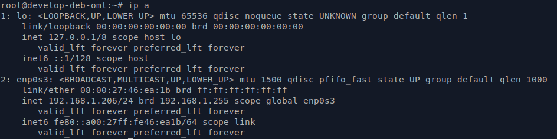
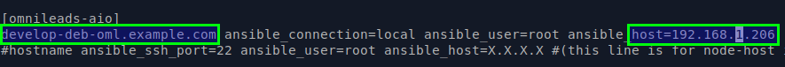

Ansible Self-Hosted Install
^^^^^^^^^^^^^^^^^^^

- Cloning the official OML repository and select release to be deployed
::

 git clone https://gitlab.com/omnileads/ominicontacto.git
 cd ominicontacto
 git checkout master
|
where "master" is the OMniLeads stable release.

- Check your hostname and ip address
::

 hostname
 ip a
|

.. image:: images/hostname_command.png
        :align: center
        

- Edit your inventory file accord to the "hostname" and "ip a" commands output

